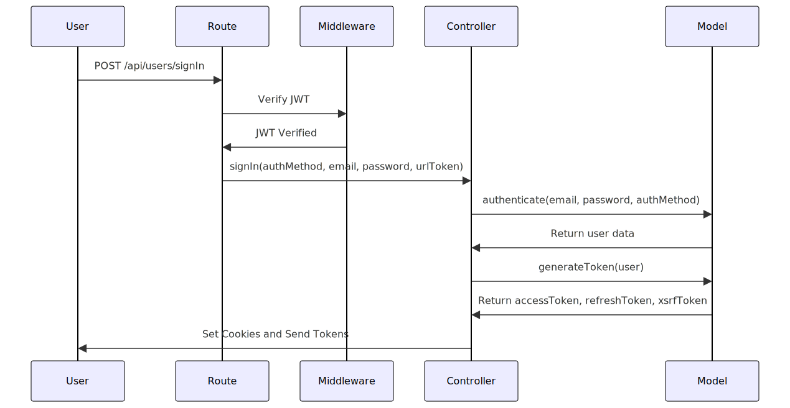

# Fluxx - Backend

Fluxx est une ossature pour toute application web moderne construite sur le paradigme de backend monolithique modulaire.

## Qu'est-ce qu'un backend monolithique modulaire ?

Un backend monolithique modulaire est une architecture de développement de logiciel où toutes les fonctionnalités d'une application sont regroupées dans une seule application, ou "monolithe", mais sont organisées de manière modulaire. Cela signifie que bien que toutes les parties de l'application résident dans un seul codebase et dépendent d'un seul déploiement, elles sont divisées en modules distincts qui encapsulent différentes fonctionnalités ou responsabilités.

### Caractéristiques principales d'un backend monolithique modulaire :

#### Monolithe :

- **Codebase unique** : Toute l'application est construite et déployée comme une seule unité.
- **Déploiement unique** : Une seule version de l'application est déployée à la fois, ce qui simplifie le processus de déploiement.

#### Modularité :

- **Modules séparés** : Le code est organisé en modules distincts, chacun avec une responsabilité ou une fonctionnalité spécifique.
- **Encapsulation** : Chaque module encapsule ses données et sa logique métier, réduisant les dépendances directes entre les modules.
- **Interface définie** : Les modules interagissent via des interfaces bien définies, facilitant la maintenance et l'évolution du code.

### Avantages :

- **Maintenance Facilitée** : La séparation en modules rend le code plus facile à comprendre et à maintenir. Les développeurs peuvent travailler sur un module sans affecter les autres.
- **Réutilisabilité** : Les modules peuvent être réutilisés dans différentes parties de l'application ou même dans d'autres projets.
- **Testabilité** : Les modules bien définis peuvent être testés de manière indépendante, améliorant ainsi la qualité du logiciel.
- **Evolutivité du Code** : Il est plus facile d'ajouter de nouvelles fonctionnalités ou de modifier les existantes sans toucher à l'ensemble du codebase.
- **Coûts d'Hébergement Extrêmement Réduits** : Comparé aux backends dans le cloud de type serverless, un backend monolithique modulaire peut offrir des coûts d'hébergement extrêmement réduits. Cela est dû au fait que vous n'avez pas besoin de payer pour chaque fonction ou service individuellement, mais plutôt pour un seul serveur qui héberge l'ensemble de l'application.
- **Légèreté et Rapidité de Fonctionnement** : Un backend monolithique modulaire est souvent plus léger et plus rapide que les solutions serverless. Cela est dû au fait qu'il n'y a pas de latence de réseau entre les services, et que toutes les parties de l'application sont exécutées dans le même processus.
- **Simplicité de Déploiement** : Avec un backend monolithique modulaire, le déploiement est généralement plus simple car il n'y a qu'une seule application à gérer.
- **Cohérence** : Toutes les parties de l'application sont développées et gérées ensemble, ce qui peut conduire à une plus grande cohérence dans le code et l'architecture.
- **Scalabilité Horizontale et Verticale** : Un backend monolithique modulaire offre une grande flexibilité en termes de scalabilité. Vous pouvez facilement augmenter la capacité de traitement en multipliant les processus au sein d'un même serveur (scalabilité verticale) ou en distribuant l'application sur plusieurs serveurs (scalabilité horizontale). En utilisant un reverse proxy en front, vous pouvez équilibrer la charge entre les différents serveurs et processus, ce qui permet à l'application de gérer efficacement une grande quantité de trafic.

### Paradigme RCM (Route-Controller-Model) :

Le paradigme RCM est une approche héritée du paradigme MVC (Model-View-Controller). Il définit la structure et l'organisation du code en trois composants principaux : Route, Controller et Model.

#### Route :

- **Définition des Chemins** : Les routes définissent les chemins d'accès (URL) aux différentes parties de l'application web.
- **Gestion des Requêtes** : Les routes gèrent les requêtes entrantes et déterminent quel contrôleur doit être utilisé en fonction de l'URL demandée.

#### Controller :

- **Logique de l'Application** : Les contrôleurs contiennent la logique de l'application. Ils prennent les données du modèle, les transforment si nécessaire, et les passent à la vue.
- **Intermédiaire** : Les contrôleurs agissent comme un intermédiaire entre les modèles et les vues. Ils reçoivent les requêtes de l'utilisateur, interagissent avec le modèle pour obtenir ou modifier les données, et renvoient une réponse à l'utilisateur.

#### Model :

- **Gestion des Données** : Les modèles gèrent les données de l'application. Ils interagissent avec la base de données, effectuent des opérations CRUD (Create, Read, Update, Delete) et renvoient les résultats au contrôleur.
- **Indépendance** : Les modèles sont indépendants de la logique de l'application et de l'interface utilisateur. Cela signifie qu'ils peuvent être réutilisés et testés indépendamment du reste de l'application.

### Avantages du Paradigme RCM :

- **Organisation du Code** : Le paradigme RCM aide à organiser le code de manière logique et cohérente, ce qui facilite la maintenance et l'évolution de l'application.
- **Séparation des Préoccupations** : Chaque composant du paradigme RCM a une responsabilité spécifique, ce qui permet une séparation claire des préoccupations.
- **Réutilisabilité et Testabilité** : Les modèles peuvent être réutilisés dans différentes parties de l'application et testés indépendamment, ce qui améliore la qualité du code.
- **Flexibilité** : Le paradigme RCM offre une grande flexibilité, car il permet de modifier ou d'ajouter des fonctionnalités à une partie de l'application sans affecter les autres parties.

## Stack technologique

### Fastify

**Fastify** est un framework web rapide et performant pour Node.js. Conçu pour offrir une efficacité maximale, Fastify promet des performances optimales grâce à une gestion efficace des requêtes HTTP. Il se distingue par sa faible surcharge (overhead) et sa capacité à gérer un grand nombre de requêtes par seconde. Fastify est également modulaire et extensible, ce qui permet aux développeurs de charger uniquement les fonctionnalités nécessaires à leur application, réduisant ainsi la complexité et améliorant les performances. De plus, Fastify offre une gestion des erreurs robuste et un support intégré pour la validation des schémas et les plugins.

### Redis

**Redis** est une base de données en mémoire, clé-valeur, reconnue pour sa rapidité exceptionnelle et sa flexibilité. Utilisé principalement comme cache, queue et store de sessions, Redis permet de stocker et récupérer des données avec une latence extrêmement faible, ce qui est crucial pour les applications nécessitant des réponses rapides et une haute performance. Dans cette stack, Redis est utilisé pour la gestion des sessions, le stockage des tokens et les opérations nécessitant un accès rapide aux données temporaires. Sa simplicité d'utilisation et sa compatibilité avec de nombreux types de données en font un choix privilégié pour optimiser les performances de l'application.

### Intégration de la Stack

Ensemble, **Node.js**, **Fastify** et **Redis** constituent une stack technologique puissante et efficace pour construire des applications web modernes. Node.js fournit la base de l'exécution côté serveur, Fastify ajoute une couche de serveur HTTP rapide et modulaire, et Redis offre une solution de stockage rapide et fiable. Cette combinaison permet de développer des applications robustes, performantes et capables de gérer de grandes charges de travail avec une latence minimale.

## Structure du projet

``` bash
├── backend/                         # Racine du projet backend
│   ├── .env                         # Fichier de configuration des variables d'environnement
│   ├── .eslintrc.js                 # Configuration ESLint pour le linting du code
│   ├── .gitignore                   # Fichiers et dossiers à ignorer par Git
│   ├── .nvmrc                       # Version de Node.js spécifiée pour NVM
│   ├── ecosystem.config.js          # Configuration PM2 pour le déploiement
│   ├── eslint.config.js             # Configuration ESLint
│   ├── jest.config.js               # Configuration Jest pour les tests unitaires
│   ├── jsdoc.json                   # Configuration JSDoc pour la documentation du code
│   ├── package.json                 # Dépendances et scripts du projet
│   ├── README.md                    # Documentation du projet
│   ├── remoteWorker.sh              # Script pour démarrer un worker à distance
│   ├── web.js                       # Point d'entrée principal de l'application web
│   ├── worker.js                    # Script pour lancer les workers
│   ├── src/                         # Contient le code source de l'application
│   │   ├── app.js                   # Fichier principal de configuration de l'application
│   │   ├── config/                  # Configuration de l'application
│   │   │   ├── assets.js            # Configuration des assets
│   │   │   ├── backend.js           # Configuration backend
│   │   │   ├── db.js                # Configuration de la base de données
│   │   │   ├── frontend.js          # Configuration frontend
│   │   │   ├── index.js             # Point d'entrée pour les configurations
│   │   │   ├── mailer.js            # Configuration du service de mail
│   │   │   └── token.js             # Configuration des tokens JWT
│   │   ├── controllers/             # Contrôleurs gérant la logique des routes
│   │   │   ├── index.js             # Point d'entrée pour les contrôleurs
│   │   │   └── user.js              # Contrôleur pour les opérations utilisateur
│   │   ├── errors/                  # Gestion des erreurs
│   │   │   ├── index.js             # Point d'entrée pour les erreurs
│   │   │   └── user.js              # Gestion des erreurs spécifiques aux utilisateurs
│   │   ├── helpers/                 # Fonctions d'aide et utilitaires
│   │   │   ├── index.js             # Point d'entrée pour les helpers
│   │   │   ├── log.js               # Fonctions de logging
│   │   │   ├── secure.js            # Fonctions de sécurité (e.g., hash de mot de passe)
│   │   │   ├── user.js              # Fonctions utilitaires pour les utilisateurs
│   │   │   └── utils.js             # Autres fonctions utilitaires
│   │   ├── middlewares/             # Middlewares de l'application
│   │   │   ├── index.js             # Point d'entrée pour les middlewares
│   │   │   └── secure.js            # Middleware de sécurité (e.g., vérification de token)
│   │   ├── models/                  # Modèles de données
│   │   │   ├── index.js             # Point d'entrée pour les modèles
│   │   │   ├── log.js               # Modèle pour les logs
│   │   │   ├── mailer.js            # Modèle pour le mailer
│   │   │   └── user.js              # Modèle pour les utilisateurs
│   │   ├── routes/                  # Définitions des routes de l'application
│   │   │   ├── index.js             # Point d'entrée pour les routes
│   │   │   └── user.js              # Routes pour les opérations utilisateur
│   │   ├── seed/                    # Scripts et données de seed
│   │   │   ├── index.js             # Point d'entrée pour les scripts de seed
│   │   │   └── user.js              # Script de seed pour les utilisateurs
│   │   ├── assets/                  # Assets utilisés pour les seeds
│   │   │   ├── fonts/               # Polices de caractères
│   │   │   │   └── Montserrat-VariableFont_wght.ttf  # Police Montserrat
│   │   │   └── images/              # Images (utilisées dans les mail, etc.)
│   ├── test/                        # Tests unitaires et d'intégration
│   │   ├── .env.test                # Variables d'environnement pour les tests
│   │   ├── app.test.js              # Tests pour l'application
│   │   └── options.js               # Options de configuration pour les tests
```
## Fonctionnalités intégrées

- **Gestion des logs** : Enregistre les événements importants et les erreurs pour le suivi et le débogage.
- **Gestion des utilisateurs** : Comprend l'authentification, l'inscription, la mise à jour, et la suppression des utilisateurs.
- **Authentification** : Utilisation de JSON Web Tokens (JWT) pour authentifier les utilisateurs.
- **Rafraîchissement des Tokens** : Gestion des tokens de rafraîchissement pour maintenir les sessions actives.
- **Rôles et Permissions** : Contrôle d'accès basé sur les rôles (par exemple, admin, utilisateur) pour sécuriser les actions critiques.

## Diagramme séquentiel du flux d’authentification de l’utilisateur



## Installation
Pour installer et exécuter le projet en local, suivez les étapes suivantes :

1. **Cloner le dépôt**
```bash
git clone git@deployment:jeremydierx/fluxx-backend.git
cd fluxx-backend
```

2. **Installer les dépendances**
```bash
npm install
```

3. ** Adapter les fichiers de configuration à vos besoins**
```bash
cp .env.example .env
cp ecosystem.config.example.js ecosystem.config.js
```

## En local

### Initialisation de la base de données

``` bash
$ npm run seed # le mot de passe admin généré se trouve dans seedUsers.txt
```

### Démarrage du serveur web en local (dev)

``` bash
$ npm run dev
```

L'application sera accessible à l'adresse `https://localhost:[port]` où `[port]` est le port configuré dans le fichier `.env`.

### Accès complet à l’application backend depuis la console nodejs

``` bash
$ node
```

puis, dans la console nodejs :

``` javascript
const app = require('./src/app')({appMode: 'console'})
```

### Execution des tests unitaires et d’intégration

``` bash
$ npm run test
```

### Génération de la documentation intégrée (JSDoc)

``` bash
$ npm run docs
```

### Linting

``` bash
$ npm run lint
```

### Démarrage des workers locaux

Pour démarrer un worker local, utilisez la commande suivante en fonction du nombre de workers que vous souhaitez démarrer :

``` bash
$ npm run worker numWorker=1 # Démarrage d'un worker
$ npm run worker numWorker=2 # Démarrage de deux workers
$ npm run worker numWorker=3 # Démarrage de trois workers
```
etc.

## En distant (serveur de production)

### Commandes de Déploiement pour l'Environnement de Production

``` bash
$ npm run remoteSetupProd # Configure l'environnement de production.
$ npm run remoteDeployProd # Met à jour l'application en production.
$ npm run remoteSeedProd # Exécute le seeding en production.
$ npm run remoteListProd # Affiche la liste des applications pm2 en production.
$ npm run remoteSaveProd # Sauvegarde l'état actuel des processus pm2 en production.
```

### Commande pour la gestion du serveur applicatif (backend web)

``` bash
$ npm run remoteWebStartProd # Démarre l'application web en production.
$ npm run remoteWebStopProd # Arrête l'application web en production.
$ npm run remoteWebRestartProd # Redémarre l'application web en production.
$ npm run remoteWebDeleteProd # Supprime l'application web en production.
```

### Commandes pour la gestion des workers en production

``` bash
$ npm run remoteWorkerStartProd # Démarre les workers distants en production.
$ npm run remoteWorkerStopProd # Arrête les workers distants en production.
$ npm run remoteWorkerRestartProd # Redémarre les workers distants en production.
$ npm run remoteWorkerDeleteProd # Supprime les workers distants en production.
```

## Pourquoi je n’utilise pas de framework «tout-en-un» ?

### Apprentissage en Profondeur:

- **Masquage de la Complexité** : Les frameworks tout-en-un ont tendance à abstraire beaucoup de complexités, ce qui peut empêcher les développeurs d'apprendre et de comprendre les mécanismes sous-jacents. Cette abstraction peut limiter la capacité des développeurs à résoudre des problèmes complexes ou à optimiser les performances de manière efficace.
- **Dépendance au Framework** : Une dépendance excessive à un framework spécifique peut restreindre la flexibilité des développeurs et les rendre moins adaptables à d'autres technologies ou paradigmes.

### Surcharge Fonctionnelle:

- **Overkill pour les Projets Simples** : Ces frameworks viennent souvent avec une multitude de fonctionnalités intégrées qui peuvent être superflues pour de nombreux projets, rendant la configuration initiale et la maintenance plus lourdes et complexes.
- **Performance Impactée** : L'inclusion de fonctionnalités non nécessaires peut alourdir l'application et impacter ses performances, surtout si ces fonctionnalités ne sont pas utilisées mais continuent de consommer des ressources.

### Flexibilité Limitée:

- **Personnalisation Difficile** : La personnalisation ou l'extension des fonctionnalités d'un framework tout-en-un peut être difficile ou impossible sans recourir à des hacks ou des contournements, ce qui peut nuire à la maintenabilité du code.
- **Contraintes architecturales** : Ces frameworks imposent souvent une architecture et une structure spécifiques, limitant la capacité des développeurs à adapter l'application à des besoins uniques ou à adopter des meilleures pratiques qui sortent du cadre défini par le framework.

## Le principe KIS (Keep It Simple)

Le principe **KIS (Keep It Simple)** prône la simplicité et l'absence de complexité inutile dans le développement et la conception. En privilégiant des solutions directes et faciles à comprendre, ce principe facilite la maintenance, réduit les erreurs et améliore l'efficacité. En se concentrant sur l'essentiel et en éliminant les éléments superflus, KIS permet de créer des systèmes plus robustes, plus accessibles et plus rapides à mettre en œuvre. Adopter KIS aide les équipes à rester agiles, à réduire les coûts et à livrer des produits de qualité supérieure en évitant les complications inutiles.

### Éviter la programmation orientée objet (POO)

Préférez les fonctions et les structures de données simples aux classes et objets complexes pour réduire la complexité du code.

### Utiliser JSDOC à la place de TypeScript

Documentez votre code JavaScript avec JSDoc pour bénéficier de l'auto-complétion et de la vérification des types, sans la complexité supplémentaire de TypeScript.

### Privilégier les solutions simples

Choisissez toujours la solution la plus simple et directe pour résoudre un problème, même si elle semble moins élégante ou moins sophistiquée.

### Éviter les abstractions inutiles

Limitez l'utilisation des abstractions (comme les interfaces, les frameworks complexes) qui peuvent rendre le code plus difficile à comprendre et à maintenir.

### Utiliser des noms de variables et de fonctions explicites

Choisissez des noms clairs et significatifs pour vos variables et fonctions afin de rendre le code auto-documenté.

### Diviser le code en petites fonctions

Écrivez des fonctions courtes et spécifiques qui effectuent une seule tâche, ce qui facilite la compréhension et la maintenance.

### Minimiser les dépendances

Réduisez le nombre de bibliothèques et de frameworks externes pour limiter les points de défaillance et simplifier la gestion des mises à jour.

### Favoriser la composition plutôt que l'héritage

Utilisez la composition de fonctions et de modules au lieu de l'héritage pour structurer votre code, ce qui permet de réutiliser et de tester plus facilement les composants.

### Écrire des tests simples et clairs

Rédigez des tests unitaires et d'intégration qui sont faciles à comprendre et à maintenir, couvrant les cas d'utilisation principaux sans surcharger le projet.

### Limiter les commentaires

Évitez de commenter chaque ligne de code. Utilisez des commentaires uniquement lorsque cela est nécessaire pour expliquer des choix non évidents.

### Utiliser des outils de linters

Employez des outils de linting comme ESLint pour automatiser la vérification de la qualité et la cohérence du code.

### Suivre les conventions de code

Adoptez et respectez des conventions de codage claires et bien définies pour maintenir un code cohérent et lisible par tous les membres de l'équipe.

### Éviter les optimisations prématurées

Ne vous concentrez pas sur l'optimisation du code avant de vérifier qu'il y a effectivement un problème de performance. Priorisez la simplicité et la clarté.

### Favoriser l'utilisation de l'outillage standard

Utilisez les fonctionnalités natives du langage et des environnements de développement avant de recourir à des solutions externes ou sur-mesure.

### Conclusion
En suivant ces principes KISS, vous pourrez créer des systèmes plus simples, plus robustes et plus faciles à maintenir, tout en réduisant les coûts et le temps de développement.

